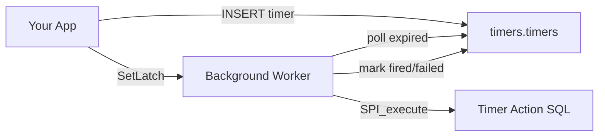
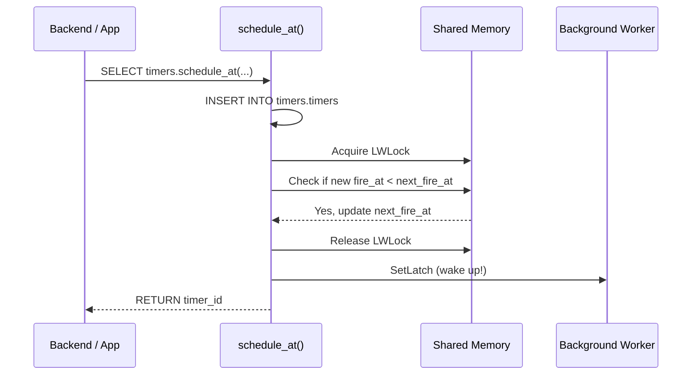
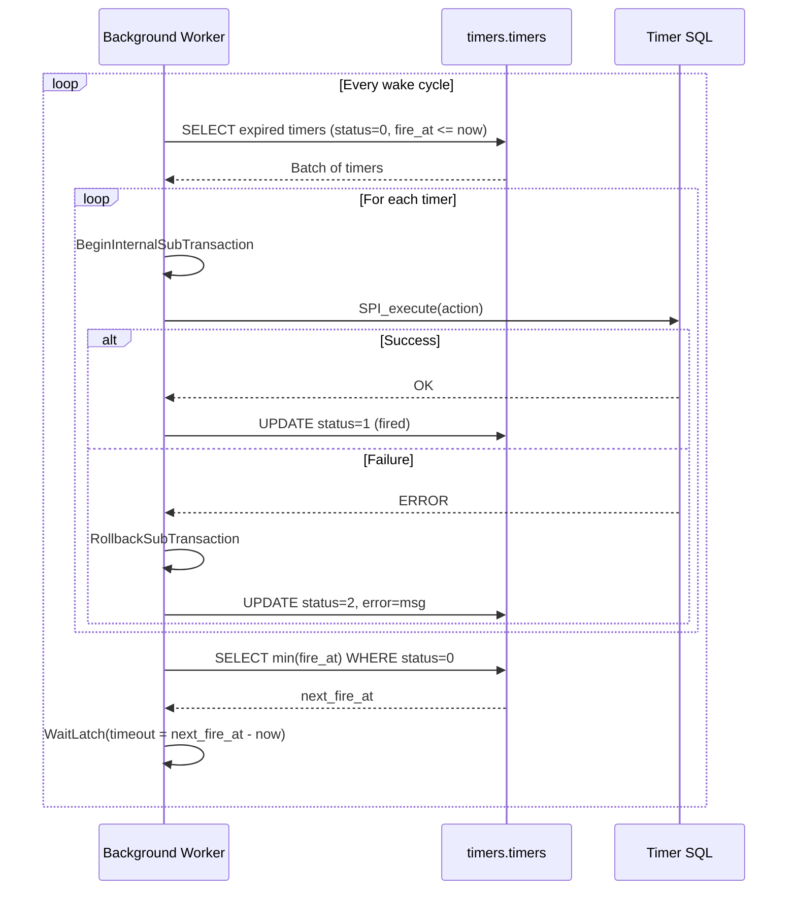
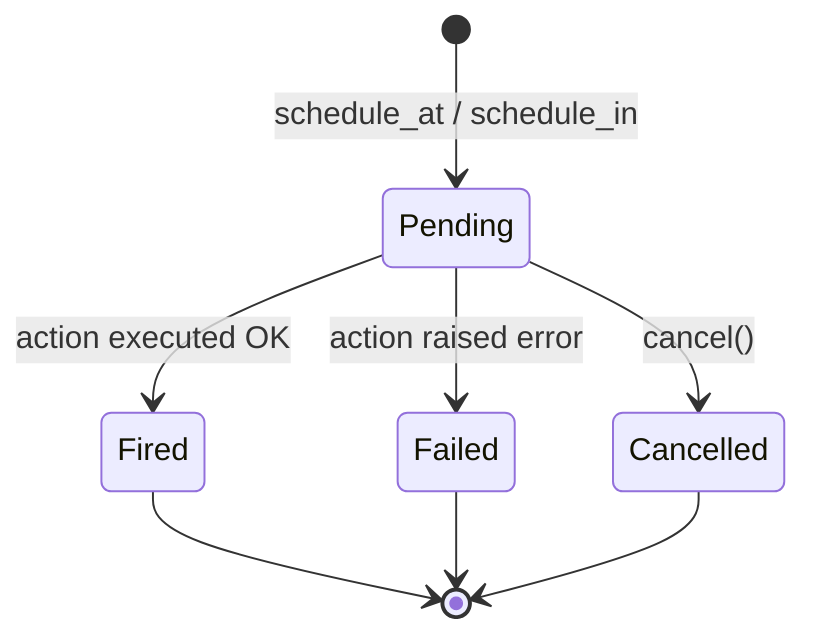

# pg_timers

Precise, low-latency timer scheduling for PostgreSQL. Schedule SQL to execute at an exact time or after an interval — powered by a background worker that wakes exactly when the next timer is due.

Designed for Citus compatibility: the timers table uses a `shard_key` distribution column, and each node runs its own background worker processing local timers.

## API

```sql
-- Fire at exact time
SELECT timers.schedule_at('2026-03-04 09:00', $$DELETE FROM sessions WHERE user_id = 42$$);

-- Fire after duration
SELECT timers.schedule_in('5 seconds', $$SELECT expire_session(42)$$);

-- Cancel a pending timer (returns true if cancelled)
SELECT timers.cancel(timer_id, shard_key);
```

All functions accept an optional `shard_key bigint DEFAULT 0` parameter for Citus distribution.

## Architecture



### Scheduling Flow



### Timer Execution Loop



### Timer State Machine



## Data Model

| Column | Type | Description |
|--------|------|-------------|
| `id` | `bigint` | Auto-generated timer ID |
| `shard_key` | `bigint` | Citus distribution key (default 0) |
| `fire_at` | `timestamptz` | When to execute |
| `action` | `text` | SQL to run |
| `status` | `smallint` | 0=pending, 1=fired, 2=failed, 3=cancelled |
| `created_at` | `timestamptz` | When the timer was created |
| `fired_at` | `timestamptz` | When the timer actually fired |
| `error` | `text` | Error message if status=2 |

Primary key is `(shard_key, id)` to satisfy Citus constraints.

## Configuration

Set these in `postgresql.conf`. GUCs marked **postmaster** require a restart; **sighup** can be reloaded with `SELECT pg_reload_conf()`.

| GUC | Default | Reload | Description |
|-----|---------|--------|-------------|
| `pg_timers.database` | `postgres` | postmaster | Database the background worker connects to. The worker runs in exactly one database per PostgreSQL instance. |
| `pg_timers.max_timers_per_tick` | `64` | sighup | Maximum number of expired timers processed per wake cycle. Higher values improve throughput at the cost of longer individual cycles. |
| `pg_timers.check_interval_ms` | `0` | sighup | Safety-net maximum sleep time (ms). `0` disables the cap — the worker sleeps until the next timer or a latch signal. Set to e.g. `60000` if you want a periodic sweep. |

## Limits

- **Single worker per instance.** One background worker process handles all timers in the configured database. It is single-threaded and processes timers sequentially.
- **Batch size.** Each wake cycle processes at most `max_timers_per_tick` expired timers. If more are due, the worker immediately wakes again for the next batch.
- **Throughput is bounded by action execution time.** A slow action (e.g., a long query) blocks the queue. Keep timer actions fast; offload heavy work to `NOTIFY`/`LISTEN` or `pg_background`.
- **No hard limit on pending timers.** The partial index `WHERE status = 0` keeps lookups efficient regardless of total table size. Old fired/failed/cancelled rows can be pruned periodically.
- **One database.** `pg_timers.database` is set at startup. To use timers in multiple databases, load the extension in each and configure separate instances (not currently supported by a single worker).
- **Maximum fire_at.** Timers can be scheduled up to year 294,276 AD (the `timestamptz` maximum). Far-future timers are stored normally; the worker sleeps until due (capped internally at ~24.8 days per sleep cycle, then rechecks).

## Installation

### Docker (recommended)

Pre-built images are published to GHCR for PostgreSQL 15–18 on amd64 and arm64:

```sh
docker run -d --name pg \
  -e POSTGRES_PASSWORD=secret -e POSTGRES_DB=mydb \
  ghcr.io/vabatta/pg_timers:18 \
  -c shared_preload_libraries=pg_timers \
  -c pg_timers.database=mydb
docker exec pg psql -U postgres -d mydb -c "CREATE EXTENSION pg_timers;"
```

For a specific version: `ghcr.io/vabatta/pg_timers:18-0.1.0`

### Kubernetes (CloudNativePG)

pg_timers ships as a standalone extension image for CloudNativePG's [ImageVolume](https://cloudnative-pg.io/blog/building-images-bake/) feature:

```yaml
apiVersion: postgresql.cnpg.io/v1
kind: Cluster
metadata:
  name: cluster-with-timers
spec:
  imageName: ghcr.io/cloudnative-pg/postgresql:18
  postgresql:
    shared_preload_libraries: ["pg_timers"]
    parameters:
      pg_timers.database: "app"
  pluginConfiguration:
    imageVolumes:
      - name: pg-timers
        image: ghcr.io/vabatta/pg_timers-cnpg:18-latest
  bootstrap:
    initdb:
      database: app
      postInitSQL:
        - CREATE EXTENSION pg_timers
```

See [`examples/cnpg-cluster.yaml`](examples/cnpg-cluster.yaml) for a full example.

### PGXN

```sh
pgxn install pg_timers
```

Requires build tools and PostgreSQL development headers on the target machine.

### From Source

```sh
# Requires pg_config on PATH
make USE_PGXS=1
sudo make install USE_PGXS=1
```

Add to `postgresql.conf`:
```
shared_preload_libraries = 'pg_timers'
pg_timers.database = 'mydb'
```

Restart PostgreSQL, then:
```sql
CREATE EXTENSION pg_timers;
```

## Development

### Prerequisites

- Docker
- [Nix](https://nixos.org/) (optional, for local builds without Docker)

### Quick Start

```sh
make dev      # start dev PG container (port 5433)
make psql     # connect via psql
make test     # run pgTAP suite
make down     # stop + cleanup
```

### Multi-Version Testing

```sh
PG_MAJOR=15 make test
PG_MAJOR=16 make test
```

### Build From Source (Nix)

```sh
nix develop          # enters shell with PG 18 + build tools
make USE_PGXS=1      # compile

# Other PG versions:
nix develop .#pg15
nix develop .#pg<version>
```

### Citus Setup

After creating the extension on the coordinator:
```sql
SELECT create_distributed_table('timers.timers', 'shard_key');
```

Each node's background worker processes only local shards. All point queries include `shard_key`.

## Reliability

### Crash Recovery

The worker executes each batch of timer actions and their status updates inside a single transaction. PostgreSQL's WAL guarantees atomicity: if the worker or the server crashes before commit, both the action's effects and the status change roll back. The timer stays `pending` and is retried when the worker restarts (after `bgw_restart_time = 5` seconds).

**For pure SQL actions, this is fully safe — no double-execution is possible.** A rolled-back action leaves no trace, and the retry is indistinguishable from a first attempt.

**Idempotency matters only for non-transactional side effects.** If your action triggers something that cannot be rolled back — such as an HTTP request via `pg_net`, a filesystem write, or an external message — then a crash-and-retry could cause that side effect to happen twice. In those cases, design your actions to be idempotent (e.g., use a unique request ID, or check for prior delivery).

### Failure Isolation

Each timer action runs in a subtransaction (`BeginInternalSubTransaction`). If one action fails, its subtransaction is rolled back and the timer is marked `status = 2` with the error text. Other timers in the same batch are unaffected.

### Concurrent Cancel

The fetch query uses `FOR UPDATE SKIP LOCKED`, so once the worker begins processing a timer, it holds a row lock until the tick transaction commits. A concurrent `cancel()` will block until the worker finishes and then see the timer is no longer pending. If a `cancel()` acquires the lock first, the worker skips that timer via `SKIP LOCKED`.

## Security

**Timer actions execute as the bootstrap superuser** via the background worker. To prevent privilege escalation, all functions and the timers table have `PUBLIC` access revoked at install time. Only the extension owner (superuser) has access by default.

Grant access to trusted roles explicitly:

```sql
GRANT EXECUTE ON FUNCTION timers.schedule_at(timestamptz, text, bigint) TO my_app_role;
GRANT EXECUTE ON FUNCTION timers.schedule_in(interval, text, bigint) TO my_app_role;
GRANT EXECUTE ON FUNCTION timers.cancel(bigint, bigint) TO my_app_role;
GRANT SELECT ON timers.timers TO my_app_role;
```

## Design Notes

- **`clock_timestamp()`** is used everywhere (not `now()`) for real wall-clock precision
- **Subtransactions** isolate action failures — one bad timer doesn't block others
- **TOCTOU protection**: status updates include `AND status = 0` so a concurrent cancel wins

## License

PostgreSQL License
